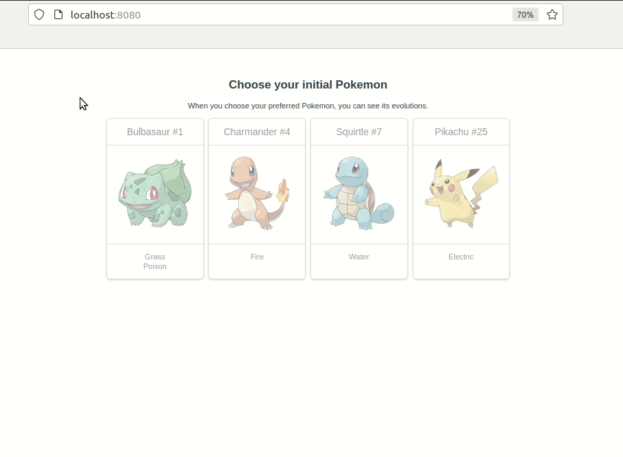

# Pokémon Evolutions API
This is a simple web application that shows a list of Pokémons (all the 4 initial Pokémons), and when the user clicks on one of the 4 Pokémons, this one is going to be focused, and its evolutions are going to be shown below them, in the same format.



## Project setup
```
yarn install
```

### Compiles and hot-reloads for development
```
yarn serve
```

### Compiles and minifies for production
```
yarn build
```

### Lints and fixes files
```
yarn lint
```

### API Documentation
https://pokeapi.co/docs/v2

### Customize configuration
See [Configuration Reference](https://cli.vuejs.org/config/).
